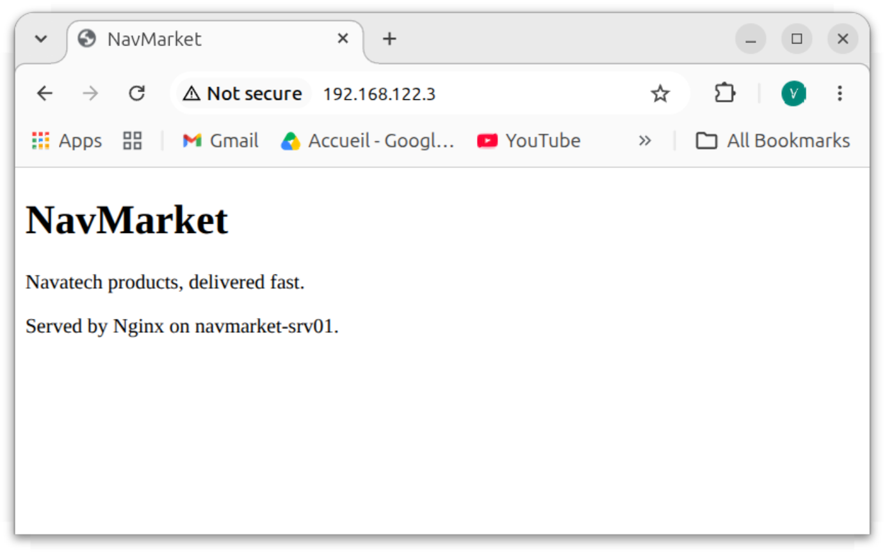

# S1.3 — NavMarket storefront served by Nginx

**Session 1 / 24 · Linux 1: using it** · Completed on 9 October 2026

## Goal

Customers must be able to see the NavMarket storefront. Install **Nginx** on `navmarket-srv01` and serve the files that the web team manages in `/srv/navmarket` (lab S1.2).

**Done when:**

1. opening `http://<VM_IP>/` from the workstation shows the NavMarket storefront, not the Nginx welcome page;
2. the site has its own configuration file, and the default site is disabled;
3. `sudo nginx -t` reports a valid configuration;
4. I can explain how a request travels from the browser to the file.



## How a request travels

```
Browser on the workstation
   │  GET / HTTP/1.1   →  <VM_IP>, TCP port 80
   ▼
nginx master process (root)       reads /etc/nginx/nginx.conf
   │                               └─ include /etc/nginx/sites-enabled/*;
   │                                    └─ navmarket → sites-available/navmarket
   ▼
nginx worker process (www-data)   server { listen 80; root /srv/navmarket; index index.html; }
   │  "/" + index  →  /srv/navmarket/index.html
   ▼
File read by www-data through the "others" rights
   /srv (r-x) → /srv/navmarket (r-x) → index.html (r--)
   │
   ▼
HTTP/1.1 200 OK + the HTML page  →  logged in /var/log/nginx/access.log
```

`www-data` is not in `webteamgrp`: it reads the storefront through the **others** rights set in S1.2 (`2775` on the directory, `664` on the file). Nothing had to be changed for Nginx, and the group still keeps write access for alice and bob.

## What I did

### 1. Install Nginx and observe the defaults

```bash
sudo apt install nginx
systemctl status nginx              # active (running), enabled at boot
sudo ss -tlnp                       # nginx listens on 0.0.0.0:80 and [::]:80
```

Before any change, the browser showed the **Nginx welcome page**: the `default` site has `root /var/www/html;` and the `index` list `index.html index.htm index.nginx-debian.html`, so Nginx served `/var/www/html/index.nginx-debian.html`.

`ss -tlnp` also shows the Nginx architecture: one **master** process (reads the configuration, manages the others) and one **worker** per vCPU (answer the requests).

### 2. Nginx configuration layout on Ubuntu

| Path | Role |
| --- | --- |
| `/etc/nginx/nginx.conf` | main file; contains `include /etc/nginx/sites-enabled/*;` |
| `/etc/nginx/sites-available/` | one configuration **file** per site, enabled or not |
| `/etc/nginx/sites-enabled/` | **symbolic links** to the sites that are active |

Enabling a site = creating a link; disabling it = removing the link. The configuration file itself stays in `sites-available`.

### 3. The NavMarket site

`/etc/nginx/sites-available/navmarket`:

```nginx
# NavMarket storefront - lab S1.3
server {
    listen 80;                       # HTTP
    server_name navmarket-srv01;     # the server's hostname
    root /srv/navmarket;             # website files, managed by webteamgrp (S1.2)
    index index.html;                # file served for "/"
}
```

### 4. Enable it, disable the default site, test, apply

```bash
sudo ln -s /etc/nginx/sites-available/navmarket /etc/nginx/sites-enabled/navmarket   # ln -s TARGET LINK_NAME
sudo unlink /etc/nginx/sites-enabled/default    # removes the link only, never a folder's content
ls -l /etc/nginx/sites-enabled/                  # one line: navmarket -> .../sites-available/navmarket
sudo nginx -t                                    # always test before applying
sudo systemctl reload nginx                      # apply without cutting current connections
```

**`reload` vs `restart`:** with `reload`, the master process rereads the configuration and replaces the workers gracefully, so visitors are not cut off; if the new configuration is invalid, it keeps the old one. The proofs show it: after the reload, the master keeps the same PID while the two workers have new PIDs. `restart` stops everything, then starts again.

### 5. The storefront page, written by the web team

```bash
sudo -u alice nano /srv/navmarket/index.html     # alice's job: the file stays alice:webteamgrp
```

### 6. Test from the workstation

```bash
curl -I http://<VM_IP>/          # headers only
curl -s http://<VM_IP>/          # the page itself
sudo tail -n 5 /var/log/nginx/access.log   # on the server: each request, its status and its client
```

## Proof

Full outputs: [`S1.3-proofs.txt`](S1.3-proofs.txt) (IP addresses replaced with `<VM_IP>` / `<WORKSTATION_IP>`), and the browser screenshot above.

- `ls -l /etc/nginx/sites-enabled/` → only `navmarket -> /etc/nginx/sites-available/navmarket`
- `sudo nginx -t` → `syntax is ok`, `test is successful`
- `systemctl is-active nginx` → `active`
- `curl -I` → `HTTP/1.1 200 OK`, `Content-Type: text/html`, `Content-Length: 233` (the size of alice's page, not of the welcome page)
- `curl -s` → the NavMarket HTML
- `access.log` → the workstation's requests with status `200`, and a `304 Not Modified` when the browser reused its cached copy (checked with the `ETag` / `Last-Modified` headers)

## Problems and solutions

### Problem 1: the site "file" was a directory

**Symptom:** `cat /etc/nginx/sites-available/navmarket` → `Is a directory`; `nano` could not save.

**Cause:** `navmarket` had been created with `mkdir`. Nginx needs a **file** with that name, not a folder containing a file.

**Solution:** check that the folder is empty (`ls -la`), remove it with `rmdir` (it refuses to delete a non-empty folder, so it is the safe tool), then create the file with `nano`. `ls -l` confirms it: the first letter is `-` for a file, `d` for a directory, `l` for a link.

### Problem 2: `ln -s` with the arguments reversed, and on folders

**Symptom:** a link `sites-enabled` appeared inside `sites-available`, and a link `sites-available` inside `sites-enabled`.

**Cause:** the order is `ln -s TARGET LINK_NAME`, and the target must be the site **file**, not the whole folder. Leaving a link to a folder in `sites-enabled/` would break Nginx, because it includes everything in that folder as configuration files.

**Solution:** remove both wrong links with `unlink`, then create the right one with absolute paths. Never put a trailing `/` on a link name when deleting it.

### Problem 3: the welcome page instead of the storefront

**Cause:** the first draft of the configuration still had `root /var/www/html;`, the folder of the default page, and the `default` site was still enabled.

**Solution:** `root /srv/navmarket;`, `index index.html;`, and the `default` link removed.

### Problem 4: `ls -l/etc/...`

A missing space after an option makes the shell pass one wrong argument. Same lesson as in S1.2: spaces separate arguments.

## What I learned

- A web server listens on a **port** (80 for HTTP); `ss -tlnp` shows who listens where.
- Nginx's layout on Ubuntu: `sites-available` (files) / `sites-enabled` (links) / `include` in `nginx.conf`.
- `root` gives the folder, `index` gives the file served for a directory.
- `ln -s TARGET LINK_NAME`; `unlink` to remove a link safely.
- **Always `nginx -t` before applying**, and prefer `reload` to `restart` on a live service.
- Nginx workers run as `www-data`; file access is decided by the permissions on the whole path.
- Reading HTTP headers: `200`, `304`, `Content-Type`, `Content-Length`, `ETag`, `Last-Modified`.
- `access.log` records every request: client, time, method, path, status, size, user agent.
- Security to do later (session 4): the `Server: nginx/1.28.3 (Ubuntu)` header reveals the exact version; `server_tokens off;` hides it, and HTTPS will remove the browser's "Not secure" warning.
